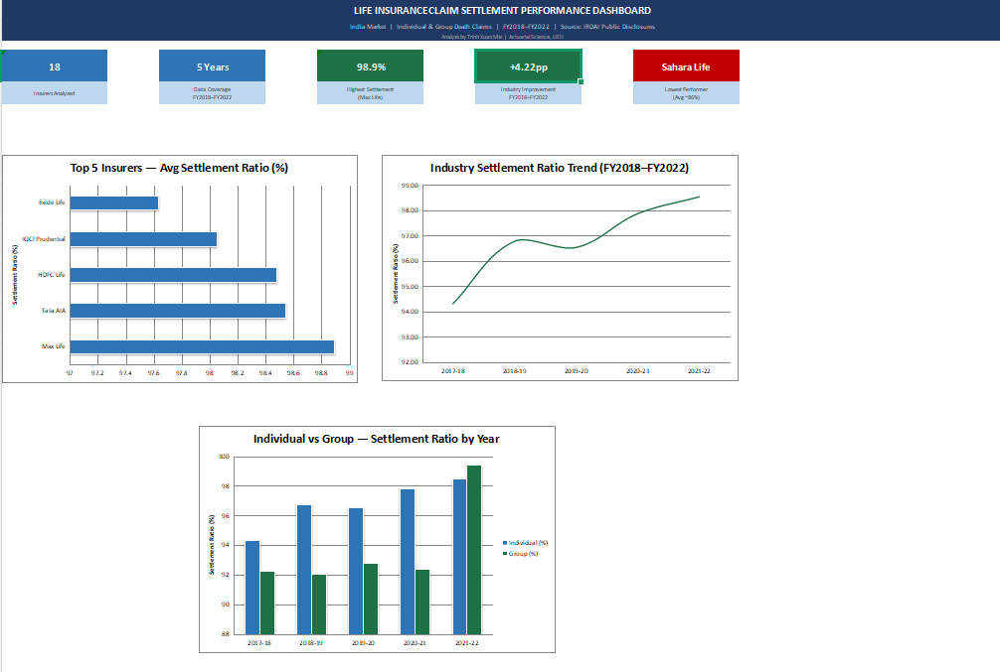

# Life Insurance Claim Settlement Performance Dashboard

## Project Overview
This project analyzes the death claim settlement performance of 18 Indian life insurers over 5 fiscal years (FY2018–FY2022), using publicly available IRDAI disclosure data. The dashboard simulates the market comparison and performance monitoring workflow typically conducted in a Product or Business Analysis role at a life insurance company.

## Tools & Technologies
- **Microsoft Excel:** Data Aggregation, Conditional Formatting (Color Scale), Basic Charting (Bar, Line, Clustered Column), Dashboard Layout Design
- **Data Source:** IRDAI (Insurance Regulatory and Development Authority of India) via Kaggle

## Dataset
| File | Description |
|---|---|
| `cleaned_individual_death_claims.csv` | Individual life policies (term, endowment) — 18 insurers × 5 fiscal years |
| `cleaned_group_death_claims.csv` | Group policies (employer-employee, credit life) — 18 insurers × 5 fiscal years |

**Key Metrics:** Claims Intimated, Claims Paid, Amount Paid (INR Cr), Settlement Ratio, Repudiation Ratio, Pending Ratio

## Data Cleaning
1. **Removed aggregate rows** — Excluded "Industry Total" and "Private Total" to prevent distortion in insurer-level rankings.
2. **Standardized insurer names** — Resolved duplicate short/full name entries (e.g., "HDFC" vs "HDFC Life").
3. **Corrected Sahara Life ratio** — Original source recorded ratio = 0 despite valid claim counts; recalculated manually as `Claims Paid / Claims Intimated`.

## Dashboard Structure
- **`Individual_Data` & `Group_Data`:** Cleaned data with color-scale conditional formatting on Settlement Ratio (Red → Yellow → Green).
- **`Analysis`:** Insurer rankings, YoY industry trend, Individual vs Group comparison.
- **`Dashboard`:** Executive summary with KPI scorecards and 3 charts:
  - Top 5 insurers by average settlement ratio
  - Industry settlement ratio trend (FY18–FY22)
  - Individual vs Group settlement ratio by year

## How to View
1. Download `Life_Insurance_Claims_Dashboard.xlsx` from t
